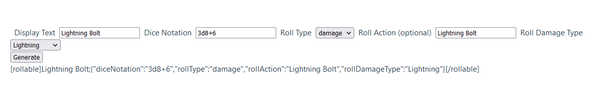
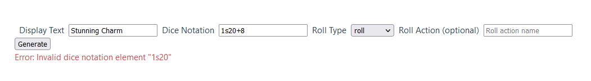

# rollable

This is a quick project to make it easier to generate rollable dice blocks on D&D beyond

The tool can be used via a GUI at https://scherma.github.io/rollable

To use the function in your own tools, import src/rollable.js

